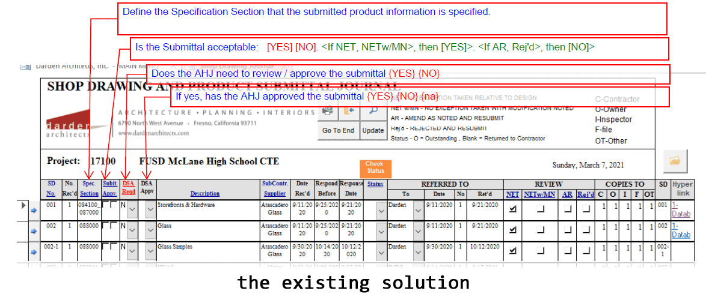
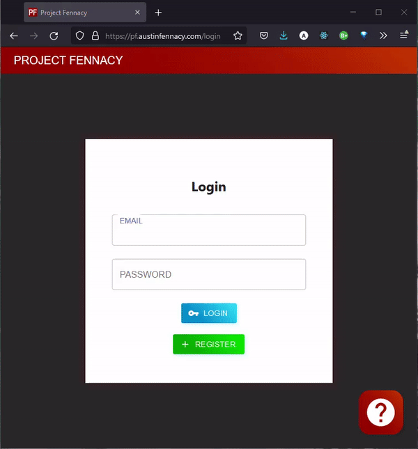
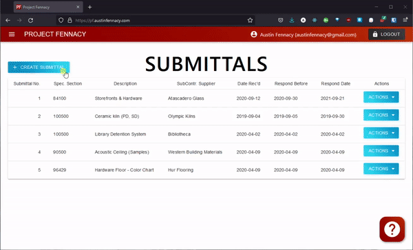
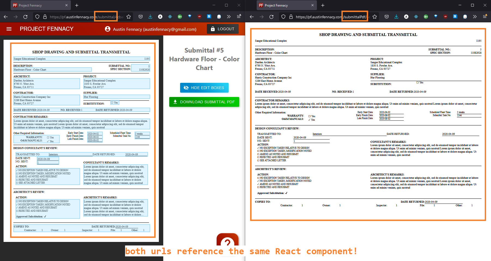
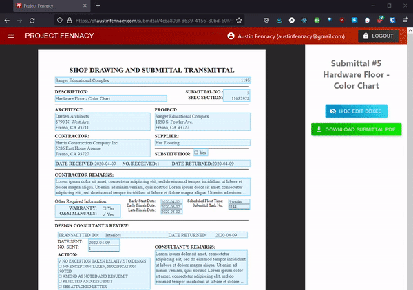
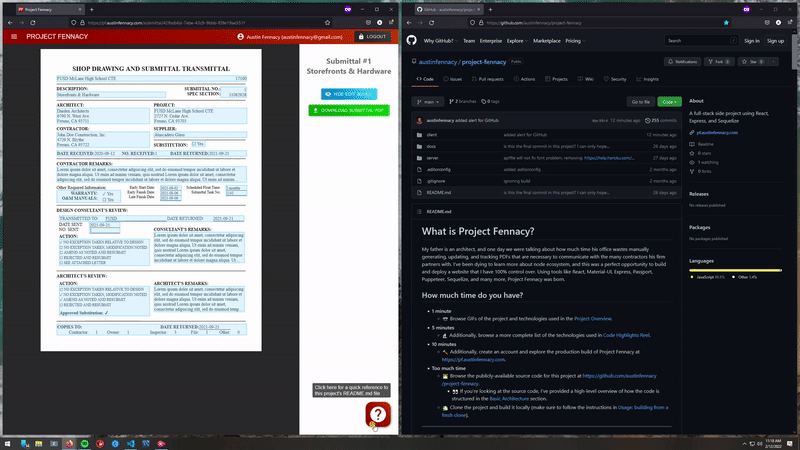

# What is Project Fennacy?

My father is an architect, and one day we were talking about how much time his office wastes manually generating, updating, and tracking PDFs that are necessary to communicate with the many contractors his firm partners with. I've been dying to learn more about node ecosystem, and this was a perfect opportunity to build and deploy a website that I have 100% control over. Using tools like React, Material-UI, Express, Passport, Puppeteer, Sequelize, and many more, Project Fennacy was born.

## How much time do you have?

- **1 minute**
  - 📷 Browse GIFs of the project and technologies used in the [Project Overview](#project-overview).
- **5 minutes**
  - 🔬 Additionally, browse a more complete list of the technologies used in [Code Highlights Reel](#code-highlights-reel).
- **10 minutes**
  - 🔨 Additionally, create an account and explore the production build of Project Fennacy at [https://pf.austinfennacy.com](https://pf.austinfennacy.com).
- **Too much time**
  - 👩‍💻 Browse the publicly-available source code for this project at [https://github.com/austinfennacy/project-fennacy](https://github.com/austinfennacy/project-fennacy).
    - 👀 If you're looking at the source code, I've provided a high-level overview of how the code is structured in the [Basic Architecture](#basic-architecture) section.
  - 🏡 Clone the project and build it locally (make sure to follow the instructions in [Usage: building from a fresh clone](#usage-building-from-a-fresh-clone)).

---

## Table of Contents

1. [Project Overview](#project-overview)
2. [Code Highlights Reel](#code-highlights-reel)
3. [Basic Architecture](#basic-architecture)
4. [Usage: building from a fresh clone](#usage-building-from-a-fresh-clone)
5. [FAQ: understanding an Architect's use case](#faq-understanding-an-architects-use-case)
6. The Production Build: [https://pf.austinfennacy.com](https://pf.austinfennacy.com)
7. My Website: [https://austinfennacy.com](https://austinfennacy.com)
8. LinkedIn: [https://www.linkedin.com/in/austin-fennacy/](https://www.linkedin.com/in/austin-fennacy/)

---

## Project Overview

Project Fennacy is a prototype where I tried to improve upon the app my father's office is using.

Before jumping into some of the features, lets look at the Microsoft Access app that Mr. Fennacy's office currently uses, alongside my design.

### The Overview Table



And here is an existing submittal document that my father has used in his work, compared with the web app version I made to mimic the PDF and the resulting PDF download.

### An Individual Submittal


The existing solution can only be accessed locally on office machines, or by using a VPN into the office network. Anyone that's had to use a VPN for private office tooling knows how frustratingly slow that proces can be.

My solution is a web app that can be used remotely, since it is protected via login (a non-prototype version would not allow public account registration). Passwords are hashed using bcrypt, and user sessions are managed by Passport.

### Registration & Login



The Access app his office uses does not automatically sync data between the overview table and the linked PDF documents. Documents must be stored in Box, and architects must save the file's stored path in a field in the Access app. In order to make changes, both the app and the PDF must be separately edited.

This is an obvious area for improvement, and is trivial for a web app that is also responsible for PDF generation.

### Create, Read, Update, & Delete



Didn't catch all that? Want to click through at your own pace? Try it yourself! [https://pf.austinfennacy.com](https://pf.austinfennacy.com)

Obviously, making updates propagate throughout the app would allow for architects to quickly correct errors in both the PDF and the record table.

### PDF Download


(you might have noticed that PDF download doesn't support emoji's, and without users to file tickets, it's probably going to stay that way - the joys of a side project 🙏🥰)

**Thank you** for reading a bit about my side project!

Want more?

- Lets link up on LinkedIn: [https://www.linkedin.com/in/austin-fennacy/](https://www.linkedin.com/in/austin-fennacy/)
- Check out my personal webpage: [https://austinfennacy.com](https://austinfennacy.com)
- Continue reading about technologies used: [Code Highlights Reel](#code-highlights-reel)
- Or, click through this project at your own pace: [https://pf.austinfennacy.com](https://pf.austinfennacy.com)


[🔙 Table of Contents](#table-of-contents)

---

## Code Highlights Reel

Before this project, I had only ever used JavaScript to crudely manage state of an HTML page. My understanding was limited and my gripes were plentiful. After this project, not only do I see JavaScript's fluidity as it's superhero strength, but I also see the role the broader node ecosystem provides in fortifying this fully comprehensive web development technology.

Here's a list of technology I learned from scratch on this project, followed by a brief selection of code I found delightful.

| Tool | Use |
|--|--|
| React | Component-based user interface library for the Client |
| Material-UI | React css templates and tools |
| React Router | Client side routing |
| React Spinners | Prebuilt loading spinners |
| Express | Web server framework for Node |
| Express Session | Handled server sessions to store user data between HTTP requests |
| bcrypt | Industry-standard password hash generator |
| Passport | Authentication for Express servers |
| Puppeteer | Headless chrome browser, used to generate PDFs |
| Sequelize | Promise-based Node ORM for MySQL |
| MySQL | Open-source RDBMS |
| dotenv | Loads env variables, so I don't commit my secrets 😉 |

### DRY PDF Rendering

There are several ways to serve a PDF of dynamic data to a user, such as [jsPDF](https://stackoverflow.com/a/778897/9193938), which allow you to write JavaScript code and turn it into a PDF. The two largest problems I have with this approach are

1. users will benefit from seeing their PDF in-app before downloading it, and
2. developers will have to write PDFs using the library's API, instead of HTML and CSS.

Writing code such as

```js
var doc = new jsPDF()
doc.text('Hello world!', 10, 10)
doc.save('a4.pdf')
```

means not only will devs have to separately mantain a server version and a client version, but they will also be subjected to that packages microscopic community. Building a single source of truth in HTML and CSS means devs can draw upon a much larger ecosystem, and can use the same code for downloads and web rendering.

Instead, I chose to write all PDF code inside of the SubmittalPdf React component. The end user sees this component in a webpage containing the navbar, sidebar, a dark background, and selectable edit boxes served at the url `https://pf.austinfennacy.com/submittal/:uuid`. The same component is reused standalone at `https://pf.austinfennacy.com/submittalPdf/:uuid` so that Puppeteer can spin up a headless Chrome browser, navigate to the submittal, generate a PDF of the webpage, and return the dynamically generated PDF to the user for downloading.



### Responsive, Reusable Edit Highlighting

Another creative piece of code I enjoyed making was the EditableBox component (the light blue box which encapsulates portions of the PDF and allows a user to click and edit data).

A single component neatly wraps each of the PDF portions, can be shown or hidden in the web, and opens up the correct edit dialog when clicked:



This means that the component contained in `./client/src/components/submittal/edit/editableBox.js` can cleanly encapsulate any portion of the PDF, and only needs to pass whether or not the box is shown or hidden, as well as what edit dialog should be opened upon a click.

```jsx
<Grid item xs={7}>
  <label>
    Description:
  </label>
  <EditableBox
    openDialog={handleDialogState.openDescription}
    showEdit={showEdit}>
    <div>
      {submittal.description}
    </div>
  </EditableBox>
</Grid>
```

This leaves the SubmittalPdf component cleanly unaware of the messy EditableBox implementation logic.

### README.md from anywhere you'd like!

I wanted to write a thorough README.md for anyone that stumbles across this project in the future (including myself!). This information is important to display to anyone viewing the project on GitHub, but I realized having an overview of the application's functionality would be nice to have inside the application as well! In case you didn't notice, the overview you're reading can be seen from both GitHub, as well as inside the production build after clicking on the (?) icon in the bottom right corner.



Displaying this README.md inside of HTML wasn't trivial for two reasons. First, I had to convert the README.md syntax to HTML, but a quick search lead me to the package `ReactMarkdown` to do the conversion. It worked like a charm, and I was able to simply write

```jsx
<ReactMarkdown>
  {markdown}
</ReactMarkdown>
```

 inside my JSX. The harder problem to overcome was reaching "outside" of the client directory to reference `/client/../README.md`, given it was not contained inside the React project's `/src` folder:

```console
./project-fennacy
├───client
│   └───src
└───README.md
```

By default, `create-react-app` restricts users from doing this (and for good reasons, which I would soon discover). Nevertheless, the goal of this project was to learn, so I didn't mind experimenting with bad practices. [A StackOverflow answer](https://stackoverflow.com/a/55298684/9193938) explained that by running dev and production builds with the package `react-app-rewired` instead of `react`, I was able to "remove the ModuleScopePlugin from the used WebPack plugins, but leave the rest [and remove] the necessity to eject". Now I was able to reference my `README.md` from inside my React application, or any file in my system for that matter!

While I think this hack has a charming effect, it comes with drawbacks. The main "gotcha" I encountered was that since my Netlify build was configured to only redeploy when the `client` subdirectory had changes, my project would not automatically redeploy to production if changes were only made to the unchecked `README.md` file. This is not appropriate for a serious codebase, but given the context I find manually clicking the Netlify "Trigger deploy" button quite tolerable.

[🔙 Table of Contents](#table-of-contents)

---

## Basic Architecture

Project Fennacy uses independent server and client projects, located in `./server` and `./client`.

For brevity, only noteworthy paths and files have been outlined.

### Server Overview

from `./server/src`

```console
./server/src
├───models
│   └───enums
├───app.js
└───passport-config.js
```

`models/`: where Sequelize model templates ("classes", in a sense) are stored.

`app.js`: runs an express server to handle API routing, and contains a majority of the server's logic.

- The Client project will use javascript `fetch()` to retrieve data from the HTTP request endpoints in this file.
- Sequelize ORM is used inside various HTTP request endpoints to handle data
- Puppeteer is used in the server to launch a headless browser, navigate to the URL of the "raw" submittal, generate a PDF, and return this data to the Client for downloading.
- Crude input validation is performed.

`passport-config.js`: handles bcrypt password hashing and general passport session management.

- in a larger project, I would like to refactor out business logic from `app.js` into modules like this one.

### Client Overview

from `./client`

```console
./client
├───public
│   └───_redirects
└───src
```

`public/_redirects`: contains important production redirects that allow for React to seamlessly handle reloads, as well as correctly routing `fetch()` requests to the server's API endpoints

from `./client/src`

```console
./client/src
├───components
│   ├───login
│   ├───navbar
│   ├───notFound
│   ├───register
│   ├───submittal
│   │   └───edit
│   └───submittalTable
├───contexts
│   ├───auth
│   ├───readme
│   └───spinner
├───fonts
│   └───Times
└───App.js
```

`components/`: where the Client project stores various React **components**.

- Larger components, such as the `submittal.js` and it's 19 unique edit dialog components, are broken out into additional directories and modules

`contexts/`: where the Client project stores various React **contexts**.

- Using contexts was invaluable for sharing state without drilling it into each component tree.
- `contexts/auth/` contained all auth (is user logged in?) logic, allowing for components to cleanly protect themselves against unauthorized users in a single line of code: `const { isAuthed } = useContext(AuthContext)`.
- `contexts/spinner/` allowed code that used `fetch()` to easily show the user a spinner while waiting for the server to respond with data.

`fonts/Times/`: please don't tell the Microsoft recruiter I did this

`App.js`: runs the root React node, handles client-side routing, and contains additional authorization-checking logic to protect routes.

[🔙 Table of Contents](#table-of-contents)

---

## Usage: Building from a Fresh Clone

- `npm install` in ./src/server and in ./src/client
- in Windows or the OS of your choice, install MySQL, create user & save db_myusername and db_mypassword
  - to keep it simple, have server (MySQL80 Service) automatically run on startup
- navigate to `./server`, create a file named `.env`, and populate it:
  - note: there are no quotes used surrounding db_myusername and db_mypassword (see npm dotenv for more)
  - also generate a random guid to store for SESSION_SECRET, to be used by npm package express-session

```env
DB_HOST=localhost
DB_USER=db_myusername
DB_PASS=db_mypassword
SESSION_SECRET=my_randomly_generated_secret
```

- start MySQL server
  - if unsuccessfull, check Windows>Start>Services>MySQL80
- ensure you are in the git branch `local-development` and not `main`, which is used for production
- navigate to `./server` and run

```console
npm run init_db
```

- to start the server and client concurrently (reccomended), run

```console
cd server
npm run dev
```

- alternatively, you may run the server and client separately by navigating into `./client` and `./server` and using the command

```console
npm start
```

[🔙 Table of Contents](#table-of-contents)

---

## FAQ: understanding an Architect's use case

### What is a Submittal?

A submittal is a short PDF document that acts as a cover letter for a package of documents being submitted to subcontractors. For example, if my dad was designing a building containing an auditorium, he might send out a submittal for Acoustic Ceiling Samples to Western Building Materials. The submittal acts as a high level overview of a specific material procurement request.

### What is the existing solution?

Currently, my dad's office is using a homebuilt Microsoft Access program to keep track of submittals.


This app is mostly a large table with several fields for data entry, but none of these fields are in sync with what is input in PDFs. PDFs are individually populated in Adobe Acrobat from a template Submittal PDF, uploaded to a specific folder in Box (a cloud storage platform), and then the location of that file is copied into the Access app. There is no direct linkage or syncing. Since they don't use a web application with user login, the only way to access these private documents is to VPN into the slow office network.


[🔙 Table of Contents](#table-of-contents)

---

## Motivation

> You may have been told, or felt yourself, that JS is a deeply flawed language that was poorly designed and inconsistently implemented. Many have asserted that it's the worst most popular language in the world; that nobody writes JS because they want to, only because they have to given its place at the center of the web. That's a ridiculous, unhealthy, and wholly condescending claim. Millions of developers write JavaScript every day, and many of them appreciate and respect the language. <https://github.com/getify/You-Dont-Know-JS/blob/2nd-ed/preface.md>

Almost a year ago, I recorded this quote to help me perservere with JavaScript's dynamic typing, lack of classes, and messy truthy variables. Coming from a C# background, these were deeply frustrating and challenged the way I thought about code. However, no matter how valid arguments against the language are, JavaScript is ubiquitous with the web, which makes it inherently necessary. After spending countless hours with this project, I proudly love JavaScript, quirks-and-all. I am much better equipped to understand the value it and the node ecosystem provide for rapid, elegant, and powerful web development.

[🔙 Table of Contents](#table-of-contents)

---

## Thanks!

I hope you enjoyed learning about my project as much as I enjoyed learning alongside it.

🎊
